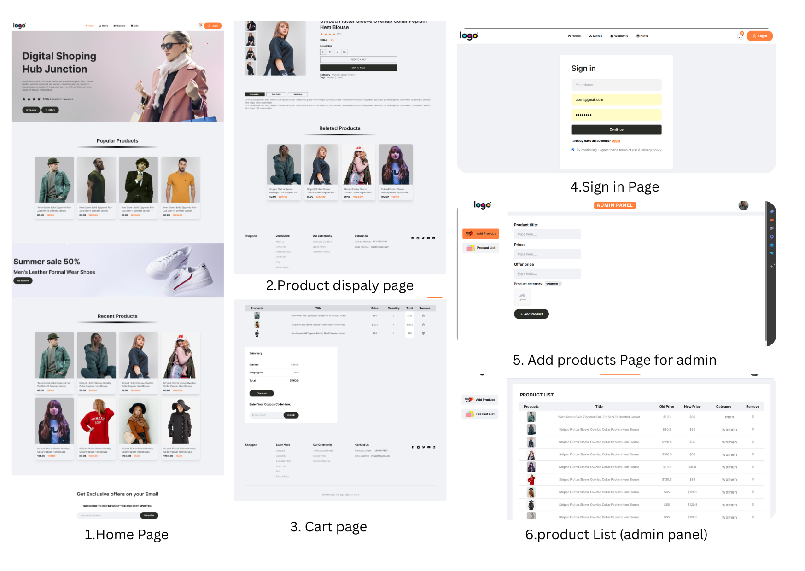

# E-Commerce MERN App

An e-commerce web application built with the MERN stack (MongoDB, Express, React, Node.js) and styled with Tailwind CSS. This app provides a platform for users to browse products, add them to a cart, and proceed to checkout.

## Table of Contents

- [Features](#features)
- [Screenshot](#Screenshot)
- [Technologies](#technologies)
- [Installation](#installation)
- [Usage](#usage)
- [Configuration](#configuration)
- [API Documentation](#api-documentation)
- [Contributing](#contributing)


## Features

- User authentication and authorization
- Product listing and search
- Shopping cart functionality
- Order management
- Admin dashboard for managing products 
- Responsive design using Tailwind CSS

## Screenshot



## Technologies

- **Frontend**: React, Redux, Tailwind CSS
- **Backend**: Node.js, Express
- **Database**: MongoDB
- **Authentication**: JSON Web Tokens (JWT)
- **Other**: Axios, Mongoose, bcryptjs

## Installation

To run this project locally, follow these steps:

1. **Clone the repository:**
  ```bash
git clone https://github.com/mursaleenmk3/MERN_E-Commerce.git
